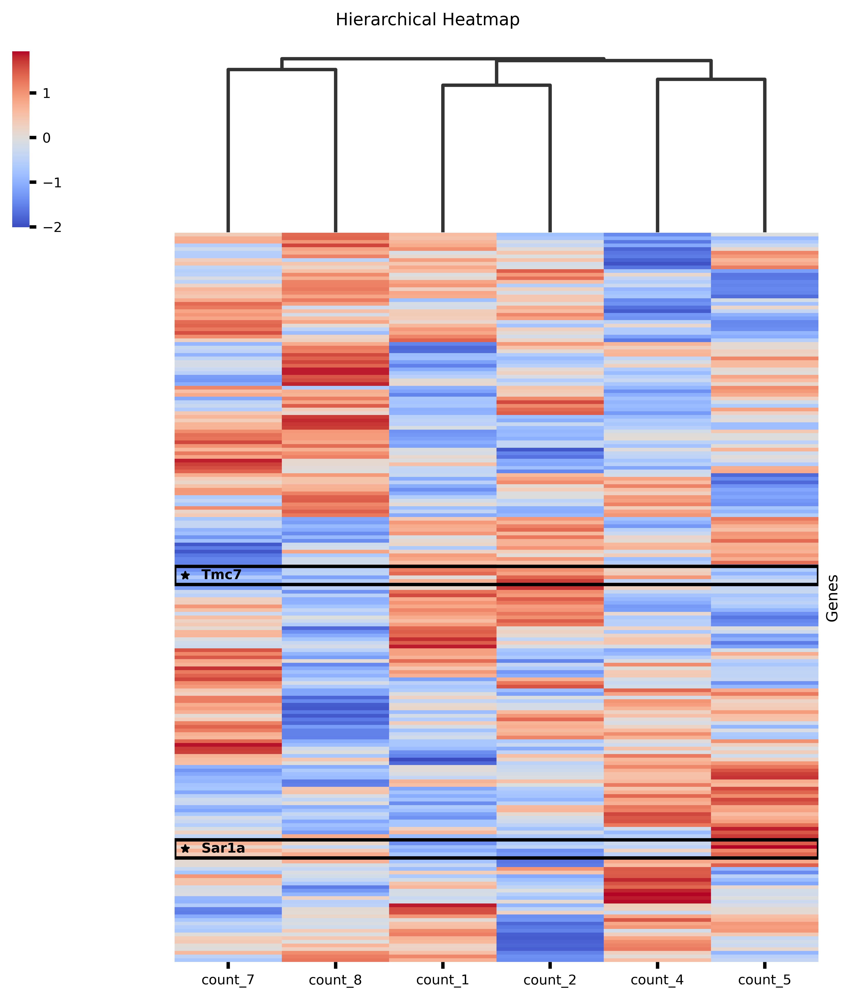
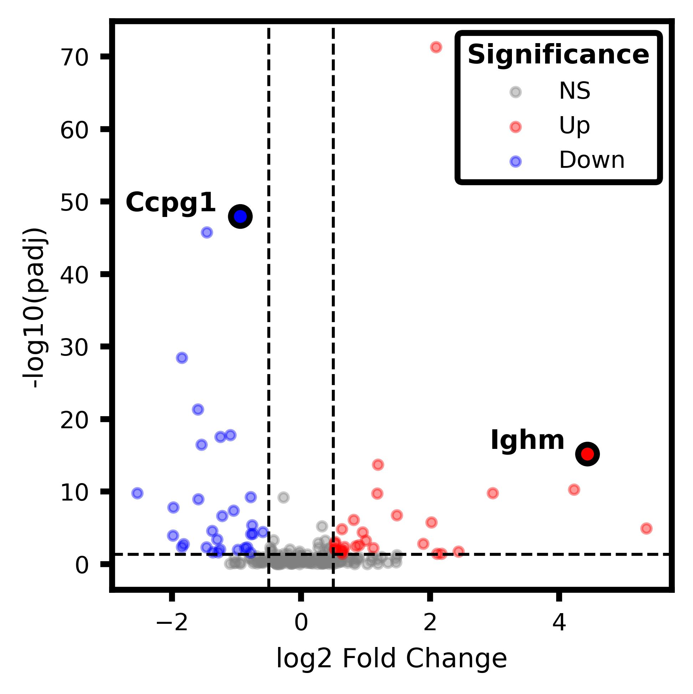
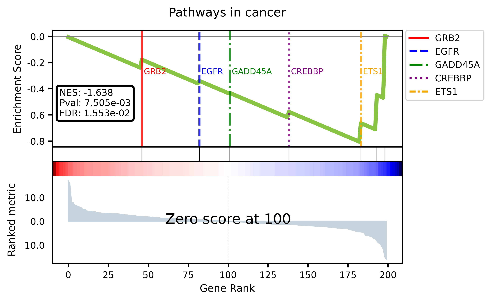

# Data Analysis Pro Plotting

**Version:** 0.1.0  

---

## Table of Contents

1. [Authors / Contributors](#authors--contributors)
2. [Overview](#overview)
3. [DOI / Citation](#doi--citation)
4. [Key Features](#key-features)
   - [General Plotting](#general-plotting)
   - [PCA Analysis](#pca-analysis)
   - [Heatmap Analysis](#heatmap-analysis)
   - [Dendrogram Metrics](#dendrogram-metrics)
   - [Volcano & GSEA Analysis](#volcano--gsea-analysis)
5. [Novelty & Advantages](#novelty--advantages)
6. [Installation](#installation)
7. [Example Notebook](#example-notebook)
8. [Example Figures](#example-figures)
9. [How to Run the Example Notebook](#how-to-run-the-example-notebook)
10. [Example Datasets](#example-datasets)

---

---

## Authors / Contributors

- **Clarisa Manzone Rodriguez, PhD** – Lead Developer  
  Facultad de Ciencias Químicas, UNC-CIBICI, CONICET  

- **Sofía Carla Angiolini, PhD** – Collaborator  
  Facultad de Ciencias Químicas, UNC-CIBICI, CONICET  

- **Claudia Elena Sotomayor, PI** – Collaborator  
  Facultad de Ciencias Químicas, UNC-CIBICI, CONICET  

- **Pablo Iribarren, PI** – Project Director  
  Facultad de Ciencias Químicas, UNC-CIBICI, CONICET  

---

## Overview

**Data Analysis Pro Plotting** is a Python library for advanced data analysis, visualization, and interpretation of results.

It is designed for flexible and high-quality plotting of complex datasets, such as omics data. The library allows highlighting specific variables (genes, proteins, or other features) directly within visualizations.

It combines computational analysis with publication-ready figures, supporting reproducible research and data-driven interpretation.

---

## DOI / Citation

Once published on Zenodo, please cite this library as:

> **Data Analysis Pro Plotting** (Version 0.1.0), Zenodo, 2026.  
> DOI: 10.5281/zenodo.XXXXXXX

---

## Key Features

### General Plotting
- `plot_barplot` — Customizable bar plots for any dataset.
- `plot_venn2` — Two-set Venn diagrams to visualize intersections.

### PCA Analysis
- `calculate_pca` — Compute principal components.
- `plot_pca` — Visualize PCA results with customizable aesthetics.
- `obtain_top_variables` — Identify top contributing variables.
- `plot_top_variables_pc` — Highlight key variables in PCA plots.

### Heatmap Analysis
- `calculate_distance_matrix` — Compute distance matrices.
- `plot_distance_heatmap` — Visualize distance matrices as heatmaps.
- `hierarchical_heatmap_matrix` — Hierarchical clustering for complex datasets.
- `plot_hierarchical_heatmap_highlighted_genes` — Highlight selected genes/features.

### Dendrogram Metrics
- `calculate_samples_dendogram` — Compute dendrogram for clustering.
- `plot_samples_dendogram` — Plot customized dendrograms.

### Volcano & GSEA Analysis
- `plot_volcano_highlighted_genes` — Volcano plots with highlighted variables.
- `plot_gsea_with_genes` — GSEA visualization with specific feature highlighting.

---

## Novelty & Advantages

- **Variable-level highlighting** — Mark specific genes, proteins, or features directly in volcano plots, heatmaps, and GSEA visualizations.
- **Highly customizable** — Extensive control over colors, styles, labels, sizes, and layout.
- **Flexible inputs** — Compatible with omics and other matrix-based datasets.
- **Integrated workflow** — PCA, clustering, heatmaps, volcano plots, and GSEA in a unified framework.

---

## Installation

**Note:** Python 3.11 or higher is recommended (to match the versions in requirements.txt). Make sure Python is installed in your system.

```bash
python --version
```

Clone the repository and install dependencies:

```bash
git clone <URL-of-your-repository>
cd "Library development"   
pip install -r requirements.txt
```
**Important:** Replace `<URL-of-your-repository>` with the actual link to your repository before running the commands.

For example:

```bash
git clone https://github.com/clarisamanzone/data_analysis_pro_plotting.git
```

## Example Notebook

A fully worked-out example is included in the repository:

- `notebooks/example_notebook.ipynb` — Demonstrates the usage of all major functions, including PCA, heatmaps, volcano plots, and GSEA visualizations. The notebook uses the example dataset provided in `data/`.

You can run this notebook directly in **Jupyter Notebook**, **JupyterLab**, or **Google Colab** to see the library in action. It illustrates:

- How to prepare and input your dataset for analysis
- PCA computation and extraction of top contributing variables (loadings)
- Generation of fully customizable, publication-ready PCA plots
- Heatmap generation with hierarchical clustering and highlighted genes/features
- Volcano plot and GSEA visualizations with variable-level highlighting
- Generation of publication-ready figures with full control over colors, labels, and styles

> **Tip:** The notebook is self-contained — run all cells sequentially to reproduce the results exactly as shown.

## Example Figures

#### Hierarchical Heatmap


#### Volcano Plot


#### GSEA Plot


## How to Run the Example Notebook

1. **Clone the repository:**

```bash
git clone <URL-of-your-repository>
cd "Library development"
```

2. **Install dependencies:**
```bash
pip install -r requirements.txt
```

3. **Open the Notebook:**

- In **Jupyter Notebook** or **JupyterLab**, open `notebooks/example_notebook.ipynb`.  
- Or in **Google Colab**, upload the notebook and make sure the `data/` folder is accessible.  

4. **Run the Notebook:**

- Run all cells sequentially to reproduce the analyses and figures.  
- The notebook automatically imports the library and loads the example datasets using relative paths.  
- Figures are saved in `notebooks/figures/` if generated.  

> **Tip:** No modifications to the notebook or library path are required; everything works relative to the repository structure.

## Example Datasets

The example datasets included in this repository are derived from the publicly available GEO dataset [GSE109297](https://www.ncbi.nlm.nih.gov/geo/query/acc.cgi?acc=GSE109297).  

For demonstration purposes:

- Only 200 genes were selected from the original dataset.  
- The expression values were modified internally by adding noise to anonymize the data and prevent disclosure of the original study results.  

These datasets are provided **for illustrative purposes only** and do not represent the original study outcomes.  

**Original study citation:**  
Qian J, Luo F, Yang J, Liu J, Liu R, Wang L, Wang C, Deng Y, Lu Z, Wang Y, Lu M, Wang J-Y, Chu Y.  
*TLR2 Promotes Glioma Immune Evasion by Downregulating MHC Class II Molecules in Microglia.*  
Available at: [GEO GSE109297](https://www.ncbi.nlm.nih.gov/geo/query/acc.cgi?acc=GSE109297)
